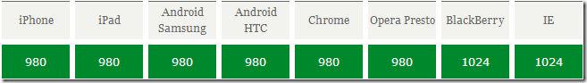
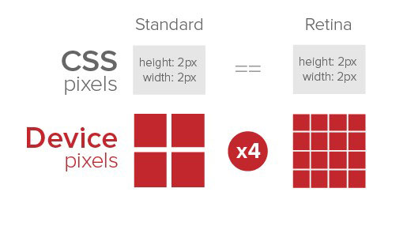
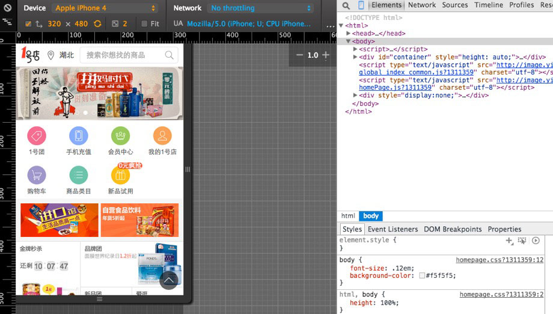

# （一）移动端入门，和调试工具介绍

## 本节课目标

对移动端网页有初步的认识，熟悉开发模式和调试工具。

## 本节课涉及知识点

* viewport：移动设备的视窗
* devicePixelRatio：设备像素比
* Chrome 模拟器
* weinre：调试工具


## viewport

移动设备上的viewport就是设备的屏幕上能用来显示我们的网页的那一块区域。



手机浏览器里打开一个网页，如果没经过优化，你会发现，网页会占满整个屏幕，而且文字都很小。这对手机用户是非常不好的体验，这里涉及到的知识叫viewport。加上这个meta标签后，页面就会按照手机的屏幕来适配了。

示例：

[PC页面](https://ximan.github.io/mobile-lesson/lesson01/01_pc_page.html)、

[H5页面](https://ximan.github.io/mobile-lesson/lesson01/02_h5_page.html)

```
<meta name="viewport" content="width=device-width, user-scalable=0">
```

### meta viewport 的6个属性

| 属性           |  值                                                          |
|---------------|--------------------------------------------------------------|
| width         | 设置layout viewport  的宽度，为一个正整数，或字符串"width-device" |
| initial-scale | 设置页面的初始缩放值，为一个数字，可以带小数                       |
| minimum-scale | 允许用户的最小缩放值，为一个数字，可以带小数                       |
| maximum-scale | 允许用户的最大缩放值，为一个数字，可以带小数                       |
| height        | 设置layout viewport  的高度，这个属性对我们并不重要，很少使用      |
| user-scalable | 是否允许用户进行缩放，值为"no"或"yes", no 代表不允许，yes代表允许   |

### 移动端布局viewport业界主流方法

* `width=device-width` 大部分网页都是网页宽度等于设备宽度
* 动态计算viewport，代表：lib.flexible，[计算viewport示例](https://ximan.github.io/mobile-lesson/lesson01/03_rem_viewport.html)
* `width=640` 按照设计稿，定死viewport宽度

[计算viewport示例](https://ximan.github.io/mobile-lesson/lesson01/03_rem_viewport.html)

## devicePixelRatio

devicePixelRatio是设备上物理像素和设备独立像素的比例。

为什么iPhone 4的640x960分辨率、iPhone 6的750x1334分辨率，即使网页上设置了meta设备宽度等于屏幕宽度`width=device-width`，实际网页却是320x480、375x667？为什么你在网页里加了一个img标签，插入一张图片，结果手机显示特别模糊？[图片示例](https://ximan.github.io/mobile-lesson/lesson01/04_image.html)。这个就是devicePixelRatio引发的问题。

[图片示例](https://ximan.github.io/mobile-lesson/lesson01/04_image.html)



### devicePixelRatio注意事项

* 设备像素比不一样，会导致网页宽度不一样
* 设备像素比不一样，会导致图片清晰度失真

## 移动端交互细节与PC不同

| PC                                  | 移动端                                           |
|-------------------------------------|-------------------------------------------------|
| click / hover
                       | touchstart / touchmove / touchend
 / touchcancel |
| :link / :visited / :hover / :active | :link / :active                                 |

PC用jQuery，移动端可以考虑用[Zepto](http://zeptojs.com/)代替

## HTML5+CSS3


移动端支持大部分的HTML5和CSS3，[具体兼容性查询](http://caniuse.com/)

## Chrome 模拟器



## weinre 调试

新建weinre文件夹，进入文件夹，`npm install weinre`

启动命令：`weinre --boundHost -all-`

按照提示打开：http://localhost:8080，把里面的script标签插入需要调试的网页。

## 扩展阅读

[移动前端开发之viewport的深入理解](http://www.cnblogs.com/2050/p/3877280.html)、
[lib.flexible](https://github.com/amfe/lib-flexible)、
[手机端网页调试方案](https://segmentfault.com/a/1190000000313211)

## 课下作业

写一个手机网页，包含头部标题模块、中间整屏banner模块、下面正文模块、底部版权模块。