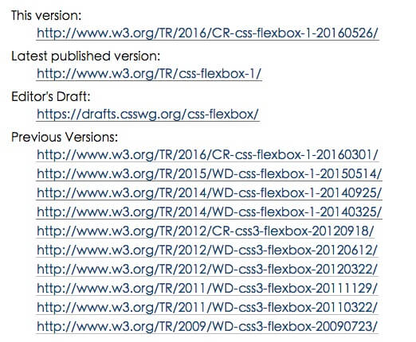
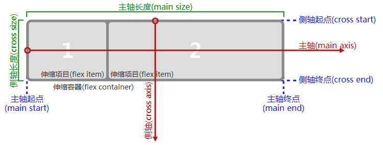
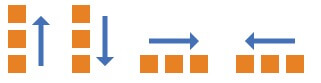
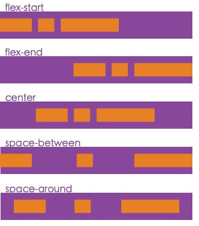
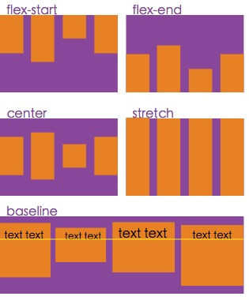
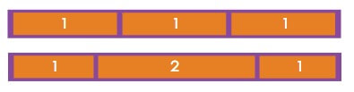
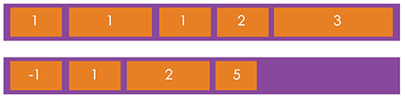
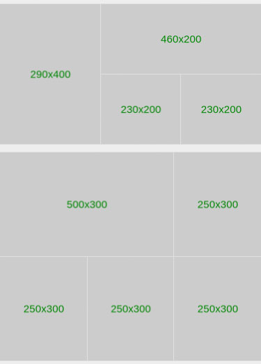

# （三）常用手机布局技巧

## 本节课目标

熟练掌握各种手机端布局技巧，不会被PC端思路局限。

## 本节课涉及知识点

* Flexbox布局详解和兼容性
* 
* 

## 移动端浏览器兼容性介绍

不得不承认，浏览器的兼容性，是前端开发永远迈不过去的坎，同时也是前端开发的价值所在。回想以前做PC项目时，用各种hack、js、两张png图等，还有很多绚丽效果低级浏览器不做，弄得焦头烂耳。而现在到了移动端，恭喜你，兼容问题依旧存在，特别是被称为手机端的IE6：微信，同样很多东西不兼容。

iOS和Android绝大部分浏览器都是机遇webkit，所以一般属性只写`-webkit`和标准两行代码即可。如果你的要求比较高，还要兼容Windows Phone的话，别忘了把`-ms`加上。

大家如果用比较冷门的CSS3属性，记得提前去[具体兼容性查询](http://caniuse.com/)查询浏览器支持情况，避免部分手机不兼容。

## Flexbox布局详解

首先来看看喜欢的人非常喜欢（例如我）、讨厌的人非常讨厌的Flexbox。



上图是截至本文时，所有官方公布的Flexbox讨论结果，居然出了10版！最新一版里，Flexbox的属性已经超过了10个！不过不要紧，因为其中一部分属性大部分手机都不支持，所以下面我介绍的是iOS 7+、Android 2.3+、Windows Phone 8+都支持的属性，大家可以放心的使用。



## Flexbox伸缩容器

### flex-direction 轴方向



* 左到右：row（默认）
* 右到左：row-reverse
* 上到下：column
* 下到上：column-reverse

### justify-content 主轴对齐



* 前：flex-start（默认）
* 后：flex-end
* 居中：center
* 两端对齐：space-between
* 平均分布：space-around（android4.4+，并且部分浏览器都不支持，不建议使用）

### align-items 侧轴对齐



* 顶：flex-start（伸缩项目固定高度的情况，默认）
* 底：flex-end
* 居中：center
* 伸展：stretch（伸缩项目不固定高度的情况，默认）
* 基线对齐：baseline（基本不用）

## Flexbox伸缩项目

### flex 放大比例

（标准版里这是3个属性的简写，因为兼容性问题，所以这里介绍的等价于flex-grow）



* &lt;number&gt;（默认为0）

### order 排序



* &lt;integer&gt;

## 水平垂直居中


[水平垂直居中](http://ximan.github.io/mobile-layout-example/center-box.html)

```
display: flex;
justify-content: center;
align-items: center;
```

```
position: absolute;
left: 50%;
top: 50%;
-webkit-transform: translate(-50%, -50%);
transform: translate(-50%, -50%);
```

## 商品列表


[商品列表](http://ximan.github.io/mobile-layout-example/product-list.html)

## 不固定个数导航


[不固定个数导航](http://ximan.github.io/mobile-layout-example/nav.html)

## 弹窗


[弹窗](http://ximan.github.io/mobile-layout-example/dialog.html)

## 滑动浮层


[滑动浮层](http://ximan.github.io/mobile-layout-example/slide-layer.html)

## 模块比例缩放


[模块比例缩放](http://ximan.github.io/mobile-layout-example/proportional.html)

## 头尾固定，中间滑动


[头尾固定，中间滑动1](http://ximan.github.io/mobile-layout-example/layout-1.html)

[头尾固定，中间滑动2](http://ximan.github.io/mobile-layout-example/layout-2.html)

## 扩展阅读

[CSS Flexible Box Layout Module Level 1](https://www.w3.org/TR/css-flexbox/)、
[一个完整的Flexbox指南](http://www.w3cplus.com/css3/a-guide-to-flexbox-new.html)

## 课下作业

请按照下图设计稿写出页面。

